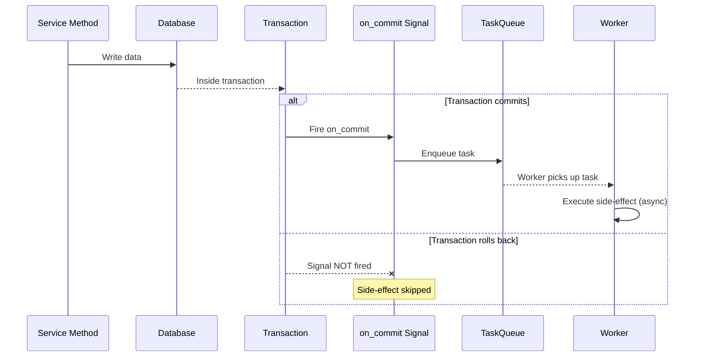

# Reliable Async Side-Effect Pattern

How to combine reinhardt signals with the task system for guaranteed post-commit side-effects.

---

## The Problem

Using `post_save` directly for side-effects is unreliable:
- The signal fires inside the transaction — if the transaction rolls back, the side-effect already ran
- Network failures in the receiver can break the main transaction
- Synchronous processing blocks the request

## The Solution: Transaction Signal + Task Queue



## Implementation

### Step 1: Define the Background Task

```rust
use reinhardt_tasks::{Task, TaskExecutor, TaskId, TaskPriority, TaskResult};
use serde::{Deserialize, Serialize};

#[derive(Debug, Serialize, Deserialize)]
pub struct SendOrderConfirmation {
    task_id: TaskId,
    order_id: Uuid,
}

impl SendOrderConfirmation {
    pub fn new(order_id: Uuid) -> Self {
        Self {
            task_id: TaskId::new(),
            order_id,
        }
    }
}

impl Task for SendOrderConfirmation {
    fn id(&self) -> TaskId {
        self.task_id
    }

    fn name(&self) -> &str {
        "send_order_confirmation"
    }

    fn priority(&self) -> TaskPriority {
        TaskPriority::new(7) // High priority
    }
}

#[async_trait]
impl TaskExecutor for SendOrderConfirmation {
    async fn execute(&self) -> TaskResult<()> {
        // Idempotent: check if already sent before sending
        // Fetch order by ID, send email, mark as notified
        Ok(())
    }
}
```

### Step 2: Connect to on_commit Signal

```rust
use reinhardt::signals::{connect_receiver, transaction};

pub fn register_order_signals() {
    connect_receiver!(
        transaction::on_commit(),
        |ctx: Arc<TransactionContext>, _receiver_ctx| async move {
            // This runs ONLY after the transaction commits
            // The task queue handles async processing
            Ok(())
        },
        dispatch_uid = "order_confirmation_on_commit"
    );
}
```

### Step 3: Enqueue Task from Service

The recommended pattern is to enqueue directly from the service, using the transaction-aware signal as a safety net:

```rust
impl OrderService {
    pub async fn create_order(&self, input: CreateOrderInput) -> Result<OrderDto, AppError> {
        let order = self.db.transaction(|tx| async move {
            let order = Order::objects(tx).create(/* ... */).await?;

            // Enqueue task — if transaction rolls back, task is discarded
            let task = SendOrderConfirmation::new(order.id.unwrap());
            TaskQueue::enqueue_in_transaction(tx, task).await?;

            Ok(order)
        }).await?;

        Ok(OrderDto::from_model(&order))
    }
}
```

## Key Rules

1. **NEVER perform side-effects inside `post_save`** — the transaction may still roll back
2. **ALWAYS use `on_commit` or transaction-aware enqueue** — guarantees the DB write is committed
3. **Task execution MUST be idempotent** — at-least-once delivery means it may run multiple times
4. **Pass IDs, not objects** — tasks are serialized; model instances cannot be serialized
5. **No cascading** — a task MUST NOT enqueue another signal-triggered task chain

## Idempotency Patterns

```rust
// Pattern 1: Check-before-act
async fn execute(&self) -> TaskResult<()> {
    let order = self.repo.get(self.order_id).await?;
    if order.notification_sent {
        return Ok(()); // Already processed
    }
    self.send_email(&order).await?;
    self.repo.mark_notified(self.order_id).await?;
    Ok(())
}

// Pattern 2: Upsert with unique constraint
async fn execute(&self) -> TaskResult<()> {
    // INSERT ... ON CONFLICT DO NOTHING
    self.repo.upsert_notification(self.order_id).await?;
    Ok(())
}
```

## When NOT to Use This Pattern

| Scenario | Use Instead |
|----------|-------------|
| Simple validation before save | `pre_save` signal |
| Synchronous field computation | Model method or service logic |
| Real-time response needed | Direct service call (no async) |
| Fire-and-forget logging | `post_save` with error swallowing |
